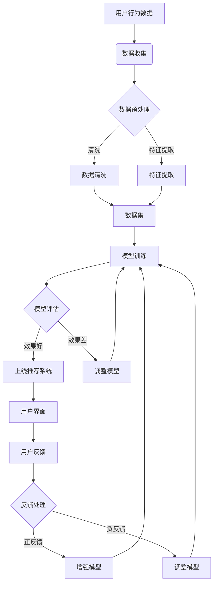

当然可以，下面是一个使用Mermaid格式描述的推荐系统工作流程图的源代码示例：

这段代码描述了一个推荐系统的典型工作流程，包括数据收集、数据预处理、数据清洗、特征提取、模型训练、模型评估、上线推荐系统、用户界面、用户反馈和反馈处理等步骤。在模型评估阶段，如果模型效果好，则会上线推荐系统；如果效果差，则会调整模型。用户反馈也会被用来增强或调整模型。

你可以将这段代码复制到支持Mermaid的Markdown编辑器中，以可视化地查看这个流程图。
