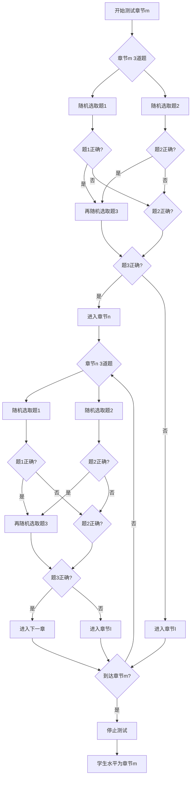

```mermaid

graph TD
    A[开始测试章节m] --> B{章节m 3道题}
    B --> C[随机选取题1]
    B --> D[随机选取题2]
    C --> E{题1正确?}
    D --> F{题2正确?}
    E -->|是| G[再随机选取题3]
    E -->|否| H{题2正确?}
    F -->|是| G
    F -->|否| H
    G --> I{题3正确?}
    H --> I
    I -->|是| J[进入章节n]
    I -->|否| K[进入章节l]
    J --> L{章节n 3道题}
    L --> M[随机选取题1]
    L --> N[随机选取题2]
    M --> O{题1正确?}
    N --> P{题2正确?}
    O -->|是| Q[再随机选取题3]
    O -->|否| R{题2正确?}
    P -->|是| Q
    P -->|否| R
    Q --> S{题3正确?}
    R --> S
    S -->|是| T[进入下一章]
    S -->|否| U[进入章节l]
    T --> V{到达章节m?}
    V -->|是| W[停止测试]
    V -->|否| L
    W --> X[学生水平为章节m]
    U --> V
    K --> V
```
